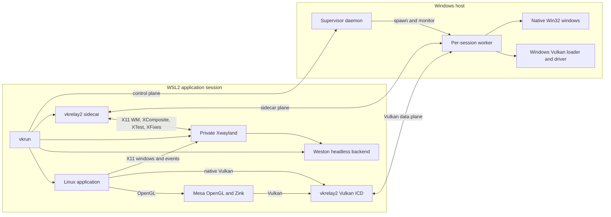

# Architecture

vkrelay2 is a split graphics and window-integration system. Linux application-facing components run
inside WSL2; GPU execution and native application windows are owned by a per-session Windows worker.
The launcher is responsible for assembling these components into one isolated application session.

## Component Map



## Session Bring-up

`linux/launcher/vkrun` is the supported entry point. For an application run it:

1. Re-executes in a private user and mount namespace when WSLg has mounted `/tmp/.X11-unix`
   read-only. The namespace receives a private writable X11 socket directory; the system WSLg
   mount is not modified.
2. Locates release artifacts first, falling back to debug artifacts when necessary.
3. Performs a protocol-level health check against the Windows supervisor. A healthy daemon is
   reused; otherwise the launcher starts one through Windows interop. A process that accepts TCP
   but does not answer the handshake is treated as wedged and is not reused.
4. Captures one immutable Windows virtual-desktop snapshot: monitor bounds, work areas, effective
   DPI, rotation metadata, primary status, and stable identities. Its virtual extent sizes the
   private X root and establishes the physical-pixel coordinate space used by the window bridge.
5. Starts a private Weston headless compositor and a rootless Xwayland server.
6. Requests a worker session from the supervisor for the selected GPU and frontend. The result
   contains separate authenticated endpoints for the application ICD and the sidecar.
7. Pins the generated vkrelay2 ICD manifest in `VK_ICD_FILENAMES` and `VK_DRIVER_FILES`. OpenGL
   sessions also receive the Mesa environment that selects Zink.
8. Starts the sidecar and waits for its explicit readiness edge after it owns the X11 WM selection,
   checks required X extensions, scans existing windows, and acknowledges readiness through the
   worker.
9. Launches the target as a child process. When the application exits, the launcher sends an
   authenticated close for its worker and waits for process-death acknowledgement, then tears down
   only the compositor, X server, sidecar, and temporary files that belong to that session. This
   explicit edge also covers pure-X11 applications that never open the Vulkan data plane.

Bring-up is fail-closed. An application is not launched against a system Vulkan driver or a mock
worker when any required relay component is missing.

## Windows Supervisor and Worker

The supervisor is the long-lived Windows control-plane process. It owns the well-known TCP listener,
enumerates adapters through the real worker-side Vulkan probe, selects a GPU from the launch
selector, creates one worker per application session, and tracks worker lifecycle. The supervisor
does not execute application Vulkan commands and does not link the Vulkan backend itself.

Each worker owns one application session:

- one selected physical device and the relay-visible logical-device object graph;
- the authenticated Vulkan data-plane listener;
- the authenticated sidecar-plane listener;
- host Vulkan objects and command replay;
- the window registry and a dedicated Win32 window thread;
- session teardown when the application connection closes, or when the owning launcher explicitly
  closes a pure-X11/no-data-plane session with its canonical application identity and session token.

The worker state model is explicit: spawned, handshaking, running, draining, and one of the terminal
states exited, crashed, or killed. The supervisor contains worker failures to the affected session.

## Vulkan Path

The Linux shared library `libvulkan_vkrelay2.so` is a Vulkan ICD. The Vulkan loader loads it from the
generated `vkrelay2_icd.json` manifest. Dispatchable handles are ICD-owned wrappers; host-side object
identifiers are transported as bounded integer handles.

The ICD performs three jobs:

1. It reports the relay-backed instance, device, extension, feature, property, queue, memory, and WSI
   surface to the application.
2. It validates structures and usage shapes that must fail locally, tracks mapped-memory shadows,
   batches command-buffer recording, and maintains application-visible object state.
3. It sends normalized RPC requests to the Windows worker and converts replies to Vulkan results.

Command-buffer commands accumulate in the ICD and are sent as one record stream at
`vkEndCommandBuffer`, rather than one network round trip per `vkCmd*` call. Host-visible mapped
memory is represented by a Linux shadow allocation; explicit flushes and coherent-submit sweeps
copy dirty ranges to the host. Readback operations copy completed host memory back into the shadow
before the application observes it.

The worker validates requests again, resolves session-scoped handles, records or executes the
corresponding host Vulkan calls, and returns structured errors. Unsupported shapes are rejected
instead of being silently narrowed.

### Frontend lanes

The launcher chooses an ICD capability lane per process:

- `auto` and `opengl46zink` select the Zink-safe lane. Mesa is steered to Zink and the relay's
  Vulkan device surface is capped to the subset used by that path.
- `vulkan13` selects the native lane. On a host Vulkan 1.3 device, the ICD reports Vulkan 1.3 only
  when the worker advertises the complete relay-required feature matrix. Otherwise its reported
  version remains lower.

Feature and extension queries are authoritative. The implementation does not assume that host
support alone makes a feature relayable.

## Window and Input Path

The application connects to a private rootless Xwayland server. Xwayland itself is backed by
Weston's headless backend, so it does not project windows through WSLg. Instead, the sidecar acts as
the private X display's window manager and sends the worker an explicit model of application
windows.

For each X11 top-level or accepted popup, the sidecar tracks a generation and the worker tracks a
representation epoch. Generation and sequence checks make stale map, unmap, paint, geometry, and
input operations harmless.

The window path includes:

- registration, update, visibility, and destruction of X11 top-levels;
- popup classification and owner linkage;
- XComposite capture of guest chrome and non-Vulkan window content into BGRA buffers, with named
  backing pixmaps invalidated on every realized resize edge before settled recapture and pixels
  outside the current XShape bounding region defined as black;
- direct host Vulkan presentation for surface-backed content;
- native Win32 window creation and painting on a dedicated message-pump thread;
- guest-to-host geometry and visibility updates;
- host-user move, resize, snap, maximize, minimize, and restore feedback to the guest;
- Win32 pointer, button, wheel, keyboard, focus, and close events queued to the sidecar;
- XTest injection into the guest and XFixes cursor capture in the reverse direction.

The ICD does not inject input or manage X11 windows. Keeping window management on a separate sidecar
connection prevents Vulkan traffic and window lifecycle traffic from sharing a dispatcher.

## Protocols and Trust Boundaries

All current cross-boundary transports use ordered TCP streams.

- The supervisor control plane uses a length-prefixed JSON message protocol. It performs versioned
  hello/ack handshakes, GPU queries, display queries, session creation, and authenticated explicit
  session close.
- The application data plane starts with a token-gated application handshake and then uses the
  Vulkan RPC frame envelope.
- The sidecar plane has a separate token, operation number space, and dispatcher. It reuses the
  bounded RPC framing but cannot dispatch Vulkan operations.

Frames are size-bounded, decoders validate types and numeric domains, and object handles are scoped
to their owning instance or device. Mixed-version fields are additive where possible and fail closed
when an older peer cannot safely serve a request.

The default supervisor bind address is `127.0.0.1`. Mirrored WSL networking keeps the protocol on
the shared host loopback. NAT-mode operation requires an explicit all-interface bind and therefore
has a larger network exposure; firewall policy is then the user's responsibility.

## Display Geometry Model

Coordinates are physical pixels. At session start the supervisor captures the complete Windows
virtual desktop under a per-monitor-aware context. The private X root is one canvas with the
snapshot virtual width and height; guest `(0,0)` maps to the signed host virtual top-left. Monitor
membership, placement, recovery, and maximize work areas all come from that same pinned snapshot.
Win32 frame extents are accounted for so guest and host client origins and extents remain 1:1.

DPI and rotation are metadata in this Level-1 model. Windows monitor rectangles already contain
their post-rotation dimensions, so the relay never rotates or scales coordinates a second time.
Crossing a DPI boundary preserves the app-authored physical-pixel extent; apparent physical size may
therefore change, and a DPI notification alone does not resize a Vulkan surface. Guest toolkits see
one giant output and one global guest DPI rather than one RandR output/scale per host monitor.

The snapshot is intentionally static for the life of the session. `WM_DISPLAYCHANGE` and relevant
work-area changes latch and log a clear restart-required condition while the old transform remains
in force; they never substitute freshly read live geometry into an active session. Per-monitor
guest DPI, per-monitor fullscreen, and transactional hotplug belong to the later multi-output model.
See [Current Limitations](usage.md#current-limitations).

## Source Ownership

```text
vkrelay2/common/argv, launch, process
    Structured argv/environment handling and platform process creation.

vkrelay2/common/protocol, transport, control
    Framing, handshakes, control messages, GPU selection, and daemon endpoint policy.

vkrelay2/common/vkrpc
    RPC operation model, request normalization, shared validation, mock backend, and profiling.

vkrelay2/common/sidecar
    Window registry, placement, input queue, capture scheduling, and sidecar wire model.

vkrelay2/linux/icd
    Application-facing Vulkan ICD and local Vulkan state.

vkrelay2/linux/launcher
    User-facing orchestration and private display lifecycle.

vkrelay2/linux/sidecar
    X11 WM/event loop, XComposite capture, XTest injection, and XFixes cursors.

vkrelay2/windows/supervisor
    Daemon, GPU probing, worker spawning, monitoring, and session ownership.

vkrelay2/windows/worker
    Real host Vulkan backend, RPC service, window registry, and Win32 message pump.
```
